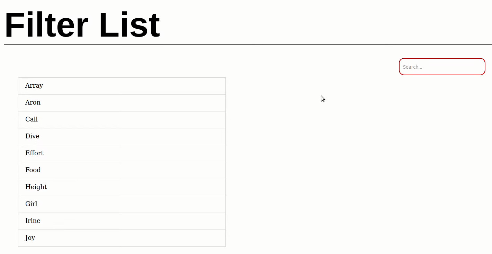
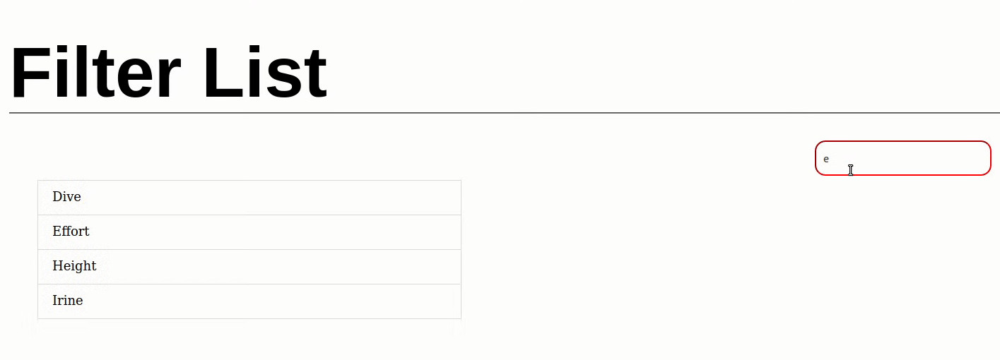

# Filter List
## Description
Filter list is a project that does the selection of a specific word in a list of words using vanilla JavaScript.

We have a search bar where the search text is inputted. The entered word is checked if it matches any word in our list. 

Next the words in our list that match the enterred text are displayed and the others disappear.  

---

## Motivation

I fell on a website with an article on filtering a list with JS. So I thought why don't I create one 

---

## Contributors
 <a href="https://github.com/tchassijordan">
 tchassi jordan</a>

---

## Contributing 
Pull requests are welcome. For major changes, please open an issue first to discuss what you would like to change.

---

<h3 align="left">Languages and tools:</h3>

    

